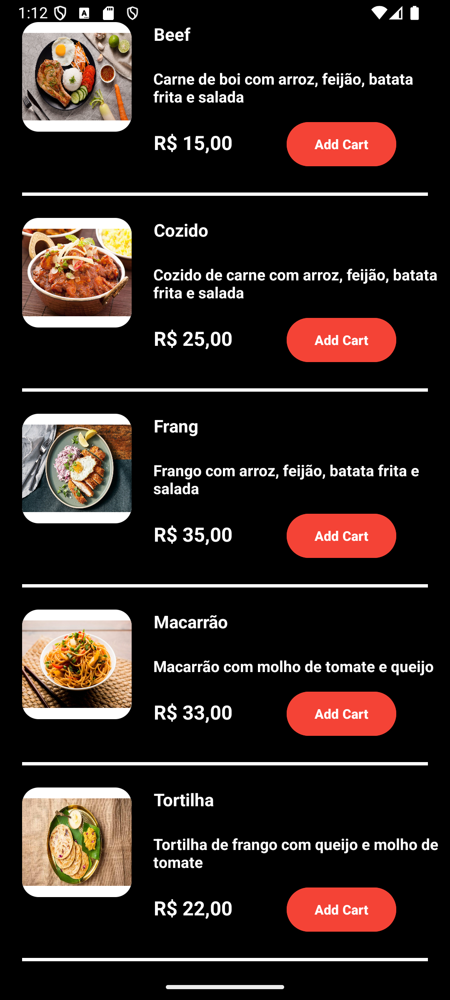

# app_restaurante

## Descrição do Projeto

Projeto de um sistema de restaurante, onde é possível realizar pedidos, visualizar cardápio, visualizar pedidos, visualizar histórico de pedidos, visualizar detalhes de um pedido, visualizar detalhes de um prato, visualizar detalhes de um cliente, visualizar detalhes de um restaurante, visualizar detalhes de um endereço, visualizar detalhes de um pagamento, visualizar detalhes de um cartão, visualizar detalhes de um boleto, visualizar detalhes de um pix

## Status do Projeto
<h4 align="center"> 
    🚧  Projeto em construção...  🚧
</h4>

